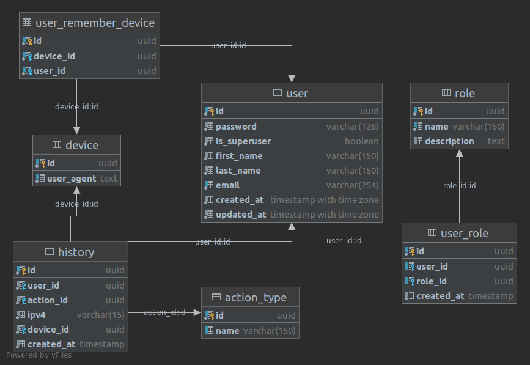

# База данных

В качестве системы управления будем  использовать `PostgreSQL`.
В ней будем хранить Пользователей, информацию о них, роли доступа, историю,
токены для jwt.

## Структура
Схема `content`

Таблицы:
1. `auth_user` - Пользователь
    - id [uuid, pk] - id пользователя
    - username [str] - ник. Логин
    - email [str, uniq] - имейл пользователя. Логин
    - first_name [str] - имя
    - last_name [str] - фамилия
    - password [str] - хешированный пароль пользователя.
    - is_superuser [bool] - суперпользователь
    - avartar [file] - аватар пользователя
    - created_at
    - updated_at

2. `auth_history` - История авторизаций
    - id
    - user_id
    - created_at
    - action_type
    - ipv4
    - user_agent
  
3. `auth_role` - Роли
    - id
    - name
    - created_at
  
4. `auth_role_user` - Таблица связки пользоватей и ролей
    - id
    - user_id
    - role_id
    - created_at

## [SQL](auth.sql)

## auth_database/auth.uml

